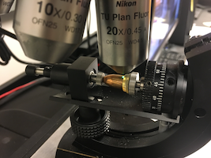

\newcommand{\hh}[1]{{\color{orange}{#1}}}
\newcommand{\kr}[1]{{\color{teal}{#1}}}
\newcommand{\ug}[1]{{\color{purple}{#1}}}


TODO: 
-\hh{Kiegan, could you use a color label, so I can see the changes you made in the file rather than as commit message? - I've made a kr command for you - you can pick the color :)} \kr{- done!}

- \hh{Could you remove the derivative files (tex, blg, writeup\_files, ...) from the repo? They cause a ton of merge conflicts.} \kr{ - done!}

- \hh{I can't find the code for figure groove\_vs\_nogroove.png - I would like to split the figure into two subfigures (top) and (bottom) with extra lines of labelling options} \kr{- I've updated it to be a generated plot! I didn't make any labelling changes yet.}

- \hh{replace the * multiplication by cdot or times} \kr{- done!}

```{r, echo = F, warning = F, message = F}
#install.packages("tidyverse")
library(tidyverse)
library(gridExtra)
```

\section{Background}  

Forensic firearms examiners analyze bullets through a process of visual feature comparison to determine whether two bullets originate from the same source. Two bullets in question are placed under a comparison microscope and firearms examiners evaluate similarities and differences between the bullets' striation marks according to the AFTE Theory of Identification [@AFTE] guidelines resulting in a decision about whether both bullets were fired through the same gun barrel. In forensic science, this problem is known as the *same source-different source problem* and focuses on establishing quantitative evidence whether two bullets were fired through the same gun barrel.  

Recent advances in technology, particularly wider access to high resolution 3D microscopy tools, have led to an increase in research focused on image-analysis algorithms for automated, quantitative analyses of bullet evidence. The introduction of this scanning technology to the field of forensic science allows for capture of high resolution 3D images of bullet LEAs, depicted in \autoref{microscope} [see @DeKinder1; @DeKinder2; @Bachrach1].  The resulting 3D images have since been used in the development of several methods for automated comparison of land engraved areas [e.g. @Ma1; @Chu1; @Chu2; @Hare1]. \kr{Make sure to reference the image somewhere in here}.

```{r microscope, echo=FALSE, out.width='\\textwidth', fig.cap='\\label{microscope}Collection of data from the surface of a bullet. Other image H44 B1 B1 L2 will go here.'}

```

In this paper, we will focus only on barrels with traditional sharp-edged lands and grooves (i.e., no polygonal rifling). Sections of the bullet that make the closest contact with the barrel are called land engraved areas (LEAs). Those alternate with groove engraved areas (GEAs). Microimperfections in the barrel introduce striae on the bullet during the firing process. The resulting striation marks provide evidence to address the same source-different source problem. A guiding principle in forensic firearms analysis is that two bullets fired through the same barrel will bear more similar striation marks on their LEAs than two bullets fired from different barrels. @Hare1 proposes a matching algorithm based on 3D imaging data of LEAs. Horizontal slices of the 3D images, called profiles, provide a detailed representation of striae impressed on the surface at a horizontal cross-section of each LEA. A current limitation of this algorithm is that it can not deal with a mix of striae from both LEA and GEAs. For the human visual system, separating the two areas is straightforward. However, the same cannot be said for automated computer vision techniques.  

A correct identification of LEAs is vital to achieve high accuracy and precision in the subsequent downstream analysis. The purpose of this paper is to discuss different automated methods for identifying so-called *shoulder locations*, the locations at which the land engraved areas end and the groove engraved areas begin.  

The structure of the paper is as follows: ... 


\section{Data Source}  

All currently published automated methods rely on high resolution 3D scans of bullet land engraved areas. Currently accepted best practice for collecting 3D images of bullet LEAs requires that bullets are staged such that striae appear vertically in the scan. Scanning across the LEA must begin and end in the neighboring groove engraved areas as shown in \autoref{fig:LEA}. Parts of the breakoff are captured as a visual reference for orientation.  

```{r LEA, echo=FALSE, out.width='\\textwidth', fig.cap='\\label{LEA}Visualization of 3D data collected through high resolution scanning of a land engraved area. Striations on the surface of the object can be seen by viewing this data from "above", as presented here.'}

```


Scans are exported from the microscope as x3p files, conforming to the ISO5436-2 standard [@ISO5436]. Each scan is captured as a matrix of $(x,y)$ locations with a measured relative height value $z$ recorded for each $(x,y)$ location on the LEA. 

The algorithm proposed by @Hare1 uses so-called crosscuts, height measurements along $x$ for a fixed $y$. \autoref{fig:process} shows the process of extracting a LEA signature based on a crosscut.  


\begin{figure}
\begin{minipage}[b]{0.45\linewidth}
    \raggedleft
    \includegraphics[width=\textwidth]{images/3d_plot_top_crosscut}
    \centering
    Step 1: 3D scan with identified horizontal crosscut
\end{minipage}
\hspace{.5cm}
\begin{minipage}[b]{0.45\linewidth}
    \raggedright
    \includegraphics[width=\textwidth]{images/profile_paper}
    \centering
    Step 2: Horizontal crosscut with identified GEA data
\end{minipage}\\

\vspace{.3cm}
\begin{minipage}[b]{0.45\linewidth}
    \raggedleft
    \includegraphics[width=\textwidth]{images/profile_paper_loess}
    \centering
    Step 3: Non-parametric curvature estimation
\end{minipage}
\hspace{.5cm}
\begin{minipage}[b]{0.45\linewidth}
    \raggedright
    \includegraphics[width=\textwidth]{images/signature_paper}
    \centering
    Step 4: Extracted LEA signature
\end{minipage}
\caption{The process of extracting a 2D signature from a 3D LEA scan described by \cite{Hare1}. GEA removal between Step 2 and Step 3 is critical to ensure precise signature extraction.}  
\label{fig:process}
\end{figure}

\kr{These next few paragraphs still need some work: Removal of the overall curve of the bullet -- the global structure captured in the 3D scanning process -- transforms these profiles into to what @Hare1 refer to as *signatures* (see \autoref{fig:process}). Similarity between two LEAs is then based on a set of extracted features such as cross-correlation function, number of consecutively matching striae [see @Biasotti] and maximum number of consecutively non-matching striae. Successful extraction of this set of features depends on how well we can remove the global bullet structure to translate from a crosscut to the corresponding signature.}  


<!-- For a land-to-land comparison \ug{comparison of two lands from two distinct 3D images?}, features such as  are calculated based on the two aligned signatures. These calculated features are then used in a random forest model to assess the degree of similarity of the corresponding pair of signatures.    -->


\kr{However, this practice introduces a challenging data structure; namely, correctly identifying between data from LEAs and GEAs.}  


\ug{The motivation for removal of GEA data lies in the algorithm proposed by @Hare1; as such, the focus will be on horizontal slices (profiles) of the 3D scans. These slices capture the striation pattern horizontally across the surface, as seen in \autoref{prof}. The sentences seem to come somewhat out of the blue and probably should also explai what happens in the algorithm by @Hare1 that requires the GEA removal.}  

\kr{Is this better??:}  

\kr{Our focus will be on horizontal slices (profiles) of the 3D scans. These profiles, which are the data used by @Hare1 to extract 2D signatures, capture the striation pattern horizontally across the surface of the object, as seen in \autoref{prof}.}

\ug{I would like to add an explanation of how the data exactly look like, namely in matrix format consisting of $x$, $y$ and $z$ unles you think it really is not necessary.} \kr{See below in the section that discusses ISO standard.} The scanned bullets come from Hamby Set 44 [@Hamby]. Each Hamby set consists of \ug{35 bullets fired from 10 consecutively?} rifled Ruger P85 barrels. Of the 35 bullets 20 bullets are known. There are two bullets for each of the ten barrels, and the remaining 15 bullets in each set are questioned bullets.  


Each fired bullet in Hamby Set 44 has 6 LEAs; every LEA was scanned for each of the 35 bullets, producing data for 210 individual lands.  Two lands -- Barrel 9, Bullet 2, Land 3 and Questioned Bullet L, Land 5 -- were removed from consideration due to "tank rash". \kr{Do we need to define this for AFTE?:} Tank rash results from a bullet striking the bottom of a water recovery tank after exiting the barrel, thereby creating marks on the land that are not due to the contact with the barrel.}  

The 3D scans of Hamby Set 44 were captured with a Sensofar Confocal light microscope at 20x magnification resulting in a resolution of 0.645 microns per pixel. These LEAs were scanned at Iowa State University's High Resolution Microscopy Facility, 

Physically, each land is approximately 2 millimeters in width; as such, data structures for a single LEA can contain more than 3 million individual data points. 


```{r prof, echo = F, warning = F, message = F, fig.height = 3, fig.cap = "\\label{prof}Single profile of 3D bullet land data. The main data structure, located in the center, is comprised of the land engraved area. The groove engraved areas are found on the left and right sides of the profile."}
hamby44_eval <- readRDS("data/hamby44/hamby44_eval.rda")
bullet <- hamby44_eval$ccdata_w_resid[[48]]
bullet %>% ggplot() + 
  theme_bw() + 
  geom_rect(xmin = -50, xmax=230, ymin = -10, ymax = 130, 
            fill = rgb(0.8,0.8,0.8, 0.1)) +
  geom_rect(xmin = 2220, xmax=2500, ymin = -10, ymax = 130, 
            fill = rgb(0.8,0.8,0.8, 0.1)) +
  geom_text(x = 1175, y = 90, label= "Land\nEngraved Area", 
            colour = "grey50", size = 5, hjust = 0.5, alpha = 0.8) +
  geom_text(x = 85, y = 110, label= "Groove\nEngraved\nArea", 
            colour = "grey50", size = 3, hjust = 0.5, alpha = 0.8) +
  geom_text(x = 2350, y = 110, label= "Groove\nEngraved\nArea", 
            colour = "grey50", size = 3, hjust = 0.5, alpha = 0.8) +
  geom_point(aes(x = x, y = value_std), size = 1) + 
  labs(x = expression(paste("Relative Location (", mu, "m)")), 
       y = expression(paste("Relative Height (", mu, "m)"))) 
  
```


The final data consists of 2D profiles gathered from 3D imaging. The height values in the profiles were averaged over ten crosscuts spaced out along the 3D image. This ensures predicted locations will be relatively applicable across the depth of the LEA scan. \ug{Again, I would like to provide again an example of the actual data. This may not be necessary for AFTE but it is important for the dissertation that you submit.} \kr{I added a small description above.}  


\section{Methodology}  


The structure in the 2D profiles is dominated by the curvature of the physical object (the bullet). To assess the  similarity of features from two land engraved areas, this curvature has to be removed.  

Non-parametric methods suggested in the literature, such as a LOESS fit [@Hare1] or a Gaussian filter [@Chu1] are very effective for removing the curvature \kr{to extract a signature. However, they are prone to boundary effects, which are mischaracterizations of data patterns near the boundaries of the data domain. In the case of LEA profiles, the boundary data values are often the same values that originate from the GEA structure.} \ug{(can you give a brief definition of what the boundary effect entails in this setting?)}. \kr{These boundary effects are exaggerated by the fact that GEA data are a secondary structure that differs from the overall structure of the LEA, seen in \autoref{prof}. As demonstrated in \autoref{groove-no-groove}, this secondary structure of outlying data results in obfuscation of the true signature pattern during the extraction process.} \kr{This next sentence woudl then get deleted: are exacerbated by the presence of the secondary structure: groove engraved areas at either end of the LEA (see \autoref{groove-no-groove}).}

\hh{ describe the figure in words, in particular the boundary effect }

```{r groove-no-groove, echo = F, warning = F, message = F, fig.cap = "\\label{groove-no-groove}An example of the impact failure to remove GEA data can have on an extracted 2D signature. Important data features are obfuscated in the signature by remaining GEA structure.", fig.height=4, fig.width = 6}
h44 <- readRDS("data/hamby44/hamby44_eval.rda")
bullet <- h44[1,]

groove <- list(groove = c(bullet$left_groove, bullet$right_groove))
bullet_sig <- bulletxtrctr::cc_get_signature(bullet$ccdata_w_resid[[1]], groove)
nogroove <- list(groove = range(bullet$ccdata_w_resid[[1]]$x))
bullet_sig_noremove <- bulletxtrctr::cc_get_signature(bullet$ccdata_w_resid[[1]], nogroove)

prof_1 <- bullet_sig %>% 
  filter(between(x, groove$groove[1], groove$groove[2])) %>%
  ggplot() + 
  geom_line(aes(x = x, y = value)) + 
  theme_bw() + 
  labs(x = "Relative Location", y = "Relative Height", 
       title = "Profile, groove data removed") + 
  theme(plot.title = element_text(size = 10), axis.title = element_text(size = 9))

sig_1 <- bullet_sig %>% ggplot() + 
  geom_line(aes(x = x, y = sig)) + 
  theme_bw() + 
  labs(x = "Relative Location", y = "Signature Height",
       title = "Signature, groove data removed") + 
  theme(plot.title = element_text(size = 10), axis.title = element_text(size = 9))

prof_2 <- bullet_sig_noremove %>% ggplot() + 
  geom_line(aes(x = x, y = value)) + 
  theme_bw() + 
  labs(x = "Relative Location", y = "Relative Height",
       title = "Profile, groove data remains") + 
  theme(plot.title = element_text(size = 10), axis.title = element_text(size = 9))

sig_2 <- bullet_sig_noremove %>% ggplot() + 
  geom_line(aes(x = x, y = sig)) + 
  theme_bw() + 
  labs(x = "Relative Location", y = "Signature Height", 
       title = "Signature, groove data remains") + 
  theme(plot.title = element_text(size = 10), axis.title = element_text(size = 9))

grid.arrange(prof_1, sig_1, prof_2, sig_2, ncol = 2)
```

\ug{the mentioning of outlying data comes out of the blue. We probably should briefly report why we go this route. This might involve a brief description of why existing methods don’t always do well which should play right into the issue of outliers.}

We implement and compare two methods for fitting the LEA structure. While the two approaches differ in methodology, they are both rooted in the ability to mitigate  influence caused by outlying data.  

\ug{The next sentence is too big of a jump. }

\kr{I think we can just remove this next sentence:} Once an appropriate fit is obtained, the fitted curve is used to obtain residual values and to determine a cutoff which separates the two competing structures.  

\subsection{Robust Linear Models}  

A natural candidate for a curved structure is a quadratic linear model.  

\hh{write the model out in math notation - that will give you a way to talk about the difference in fitting in a less abstract way.}  

Quadratic linear models fit by finding the values of $\beta_0, \beta_1, \beta_2$ which minimize: 

$$\arg\min_{\mathbf{\beta}} \left(z_i - (\beta_0 + \beta_1x_i + \beta_2x_i^2)\right)^2,$$
the vertical squared distance between each measured height value and a fitted quadratic line. The quadratic line is fit to predict measured height values, $z_i$, by location, $x_i$. \hh{the following line needs to go into the description of the previous figure. This figure already looks at the difference by using a robust method} The presence of unusual data near the boundaries results in a line that is pulled upwards towards GEA data during the minimization process, as seen in \autoref{lms}. 

An alternative approach is a robust linear model which minimizes absolute deviations in place of squared deviations: 

$$\arg\min_{\mathbf{\beta}} \left|z_i - (\beta_0 + \beta_1x_i + \beta_2x_i^2) \right|.$$

This method of minimization is less influenced by large outlying values present in the GEA data. The vast majority of data points are in the LEA structure; minimization of absolute deviations favors fitting the majority structure closely and allows the minority structures on the edges to have high residual values. Prioritization of the majority structure is here preferable to the compromise that occurs in traditional linear models due to minimizing the squared distance. A striking example of the difference in results from these two model frameworks is seen in \autoref{lms}, where the fit of a linear model compromises between the LEA and GEA structures, and fails to fit either structure appropriately.  


```{r lms, echo = F, warning = F, message = F, fig.height = 4, fig.cap = "\\label{lms}Example of a quadratic linear model fit and resulting residuals (top) compared to a robust quadratic linear model fit and residuals (bottom) for a single profile. The robust model is able to more effectively capture the curved structure of the LEA without being influenced by the GEA."}
hamby44_eval <- readRDS("data/hamby44/hamby44_eval.rda")
bullet <- hamby44_eval$ccdata_w_resid[[48]]
lm <- lm(value_std~poly(x,2), data = bullet)
bullet$lm_pred <- predict(lm, newdata = bullet)
bullet$lm_resid <- with(bullet, value_std-lm_pred)
lm0 <- MASS::rlm(value_std~poly(x,2), data=bullet, maxit=100)
bullet$rlm_pred <- predict(lm0, newdata=bullet)
#bullet$rlm_absresid <- with(bullet, abs(value_std-pred))
bullet$rlm_resid <- with(bullet, value_std-rlm_pred)

p1_rlm <- bullet %>% ggplot() + 
  geom_point(aes(x = x, y = value_std)) + 
  theme_bw() + 
  labs(x = expression(paste("Relative Location (", mu, "m)")), 
       y = expression(paste("Relative Height (", mu, "m)")), title = "Linear Model Fit") + 
  geom_line(aes(x = x, y = lm_pred), color = "red") +
  theme(axis.title.x = element_text(size = rel(1)), 
        axis.title.y = element_text(size = rel(1)), 
        axis.text.x = element_text(size = rel(1)),
        axis.text.y = element_text(size = rel(1)), 
        title = element_text(size = rel(0.7)))

p2_rlm <- bullet %>% ggplot() + 
  geom_point(aes(x = x, y = lm_resid)) + 
  theme_bw() + 
  labs(x = expression(paste("Relative Location (", mu, "m)")), 
       y = expression(paste("Residual Height (", mu, "m)")), title = "Linear Model Residuals") + 
  geom_hline(yintercept = 0, color = "red") +
  theme(axis.title.x = element_text(size = rel(1)), 
        axis.title.y = element_text(size = rel(1)), 
        axis.text.x = element_text(size = rel(1)),
        axis.text.y = element_text(size = rel(1)), 
        title = element_text(size = rel(0.7)))

p3_rlm <- bullet %>% ggplot() + 
  geom_point(aes(x = x, y = value_std)) + 
  theme_bw() + 
  labs(x = expression(paste("Relative Location (", mu, "m)")), 
       y = expression(paste("Relative Height (", mu, "m)")), title = "Robust Linear Model Fit") + 
  geom_line(aes(x = x, y = rlm_pred), color = "red") +
  theme(axis.title.x = element_text(size = rel(1)), 
        axis.title.y = element_text(size = rel(1)), 
        axis.text.x = element_text(size = rel(1)),
        axis.text.y = element_text(size = rel(1)), 
        title = element_text(size = rel(0.7)))

p4_rlm <- bullet %>% ggplot() + 
    geom_point(aes(x = x, y = rlm_resid)) + 
  theme_bw() + 
  labs(x = expression(paste("Relative Location (", mu, "m)")), 
       y = expression(paste("Residual Height (", mu, "m)")), title = "Robust Linear Model Residuals") + 
  geom_hline(yintercept = 0, color = "red") +
  theme(axis.title.x = element_text(size = rel(1)), 
        axis.title.y = element_text(size = rel(1)), 
        axis.text.x = element_text(size = rel(1)),
        axis.text.y = element_text(size = rel(1)), 
        title = element_text(size = rel(0.7)))

library(gridExtra)
grid.arrange(p1_rlm, p2_rlm, p3_rlm, p4_rlm, ncol =2 )

```


The focus on closely fitting majority structure results in residual values scattered near zero in the LEA and larger, mostly positive residuals in the GEA zones. Thus, the magnitudes of residuals can serve as an indicator of membership as LEA data or GEA data. More precisely we define the median absolute deviation (MAD). 

The MAD is a robust metric for the spread of points, similar to the standard deviation. It is preferable to the standard deviation to quantify the spread since we are dealing with an unbalanced spread of residual values.  
Let $m$ be the median:  
$$ MAD(\mathbf{z}) = m(|z_i- m(\mathbf{z})|) \quad \forall\ z_i \in \mathbf{z}.$$
\hh{Reduce the next paragraph to 2 sentences} \kr{done - I think!}  
Residual values that are considered unusually high, or outlying, are values that are larger than $4 \times$MAD. Any residual value larger than 4 times the median absolute deviation value is defined to be  a "large" residual \kr{and is likely a member of the GEA structure}.  

\hh{what does it mean to be a large residual? Nail your point!}


Shoulder location predictions are calculated for each profile in the following manner:  
\begin{enumerate}
\item Fit a robust linear model of order 2 (i.e., quadratic) to the averaged profile.   
\item Calculate a residual value for each data point on the profile.  
\item Calculate the median absolute residual (MAD) for the profile.  
\item Remove all data points on the profile whose absolute residual value is greater than $4 \times$MAD.  
\item Identify the range of the remaining x values - these are the predicted shoulder locations for that profile.   
\end{enumerate}


\subsection{Robust LOESS}  

Locally weighted regression, known as LOESS, is a non-parametric approach that is not restricted by the need for perfect quadratic curvature. This is advantageous when working with bullets, as it is unrealistic to expect a flawless circular shape to remain after the bullet has been subjected to the forces of a gun barrel and striae have been impressed upon it.  

\kr{LOESS models estimated a predicted value for each $z_i$ height by finding the values of $\beta_0, \beta_1$ which minimize: 

$$\arg\min_{\mathbf{\beta}} \sum_{k=1}^n w_k(x_{i})\left(z_{k} - (\beta_0 + \beta_1x_k)\right)^2,$$

which assigns a weight $w_k(x_i)$ to each data point with index $k$ based on its proximity to the $x_i$ of interest. Weights $w_k$ decrease as the proximity to $x_i$ decreases, so that the data points closest to $x_i$ of interest influence the prediction of $z_i$ most. This can also be described as a non-parametric weighted average of many parametric models fit to subsets of the data.  

This approach allows for greater flexibility. However, it also means that LOESS models are affected by GEA structures in a more unpredictable manner. Data points near and in the GEA structure will be most influenced by other GEA data rather than the overall global structure seen in LEA data. This results in a set of predictions which misrepresents much of the data near one or both boundaries (see \autoref{loess}).}

\kr{This next paragraph would be gone:}

LOESS fits many models to small subsets of the data and combines them into one non-parametric fit of the data, rather than focusing on the overall structure of the data. This allows for greater flexibility. However, it also means that LOESS models are affected by GEA structures in a more unpredictable manner. A model fitted on a subset of data that mainly falls in the GEA structure can look very different than a model fit with data from the LEA. This results in a combined prediction that misrepresents much of the data near one or both boundaries (see \autoref{loess}). 

\kr{XXX}.

\kr{The robust approach to LOESS uses an iterative re-weighting process to reduce the influence of outlying data points [see @Cleveland1]. First, an initial LOESS is fit. This is followed by a redistribution of $w_k(x_i)$ values based on residual values, $e_i = (z_i - \hat{z}_i)$. New weights are calculated as 
$$\left(1-\left(\frac{e_k}{6\times MAD}\right)^2\right)^2 \times w_k(x_i) \quad \quad \mbox{if}\ \left|\frac{e_k}{6\times MAD}\right| < 1.$$
Otherwise, weights are set to 0. These new weights are applied and updated predictions are calculated. This reduces the influence of data points which have large values of $e_k$ in the first LOESS iteration. In the LEA profile context, it reduces the influence of GEA data.}  

\kr{The above would replace the next paragraph.}  

Robust LOESS utilizes an iterative process focused on re-weighting [see @Cleveland1]. First, an initial LOESS fit is created. This is followed by a step which gives smaller weights to data points with high residual values, and a subsequent LOESS fit with new weights applied. The down-weighting of values with high residual values slowly reduces the influence of the GEA data. This iterative process results in a non-parametric fit to the LEA structure that treats GEA data as less important, which is desirable.  

While robust LOESS methods are more flexible than robust linear models, a model that is accurately fit to the LEA structure results in the same expected residual structure as with robust linear models: positive and negative residuals scattered around zero in the LEA zone, and positive, possibly large residuals in the GEA zones. A similar approach using a cutoff value can be employed to distinguish between "large" residual values and reasonable ones. Since non-parametric fits offer a closer fit over a large amount of data, the cutoff for separation will be lower. A cutoff that performs well on the Hamby set 44 is twice the median absolute deviation ($2\times MAD$). 


```{r loess, echo = F, warning = F, message = F, fig.height = 4, fig.cap = "\\label{loess}Example of a LOESS model fit and residuals (top) compared to a robust LOESS model fit and residuals (bottom) for a single profile. The robust model is again able to more effectively capture the curved structure of the LEA without being influenced by the GEA."}
lo <- loess(value_std~x, data = bullet, span = 1)
bullet$lo_pred <- predict(lo, newdata = bullet)
bullet$lo_resid <- bullet$value_std - bullet$lo_pred


p1_rlo <- bullet %>% ggplot() + 
  geom_point(aes(x = x, y = value_std)) + 
  theme_bw() + 
  labs(x = expression(paste("Relative Location (", mu, "m)")), 
       y = expression(paste("Relative Height (", mu, "m)")), title = "LOESS Fit") + 
  geom_line(aes(x = x, y = lo_pred), color = "red") +
  theme(axis.title.x = element_text(size = rel(1)), 
        axis.title.y = element_text(size = rel(1)), 
        axis.text.x = element_text(size = rel(1)),
        axis.text.y = element_text(size = rel(1)), 
        title = element_text(size = rel(0.7)))

p2_rlo <- bullet %>% ggplot() + 
  geom_point(aes(x = x, y = lo_resid)) + 
  theme_bw() + 
  labs(x = expression(paste("Relative Location (", mu, "m)")), 
       y = expression(paste("Residual Height (", mu, "m)")), title = "LOESS Residuals") + 
  geom_hline(yintercept = 0, color = "red") +
  theme(axis.title.x = element_text(size = rel(1)), 
        axis.title.y = element_text(size = rel(1)), 
        axis.text.x = element_text(size = rel(1)),
        axis.text.y = element_text(size = rel(1)), 
        title = element_text(size = rel(0.7)))


p3_rlo <- bullet %>% ggplot() + 
  geom_point(aes(x = x, y = value_std)) + 
  theme_bw() + 
  labs(x = expression(paste("Relative Location (", mu, "m)")), 
       y = expression(paste("Relative Height (", mu, "m)")), title = "Robust LOESS Fit") + 
  geom_line(aes(x = x, y = rlo_pred), color = "red") +
  theme(axis.title.x = element_text(size = rel(1)), 
        axis.title.y = element_text(size = rel(1)), 
        axis.text.x = element_text(size = rel(1)),
        axis.text.y = element_text(size = rel(1)), 
        title = element_text(size = rel(0.7)))


p4_rlo <- bullet %>% ggplot() + 
    geom_point(aes(x = x, y = rlo_resid)) + 
  theme_bw() + 
  labs(x = expression(paste("Relative Location (", mu, "m)")), 
       y = expression(paste("Residual Height (", mu, "m)")), title = "Robust LOESS Residuals") + 
  geom_hline(yintercept = 0, color = "red") +
  theme(axis.title.x = element_text(size = rel(1)), 
        axis.title.y = element_text(size = rel(1)), 
        axis.text.x = element_text(size = rel(1)),
        axis.text.y = element_text(size = rel(1)), 
        title = element_text(size = rel(0.7)))


#library(gridExtra)
grid.arrange(p1_rlo, p2_rlo, p3_rlo, p4_rlo, ncol =2 )
```


Shoulder location predictions are calculated for each profile in the following manner: 
\begin{enumerate}
\item Fit a robust LOESS model with a span of 1 to the averaged profile. This can be fit using the `locfit.robust` function in the `locfit` package in R.
\item Calculate a residual value for each data point on the profile.  
\item Calculate the median absolute deviation (MAD) for the profile.  
\item Remove all data points on the profile whose absolute residual value is greater than 2*MAD.  
\item Identify the range of the remaining Y values - these are the predicted shoulder locations for that profile.   
\end{enumerate}


\section{Results}  

In order to assess the accuracy of the two alternative models based on a quantitative measure for their overall performance of predictions, we first manually identified "ground truth" shoulder locations \kr{for each of the 208 profiles in Hamby set 44}. \hh{on which data? tie it back to the data section}.  

\hh{the next couple of paragraphs up to XXX need more work. You are going chronologically through the explanation - that puts too much emphasis on things we decided not to do. Come in from the back, i.e. define the measure used first, then go into some explanation.  }

\kr{Using ground truth shoulder locations, we calculate an "area of misidentification", the area in microns of a profile which is considered incorrectly identified by the method. This metric is calculated separately for the left shoulder location as:  

$$ \hat{A}_{jL} = \left|\sum_{z_{ij} \in \tilde{Z}_{jL}} (z_{ij} - \hat{z}_{ij}) \times0.645\mu m\right|,$$
where $\tilde{Z}_{jL}$ is the set of points in profile $j$ that fall between the predicted left shoulder location and ground truth left shoulder location, and $\hat{z}_{ij}$ is the predicted height value at location $i$ from the robust LOESS fit to profile $j$.  

The analogous area is calculated for the right shoulder location as: 

$$\hat{A}_{jR} = \left|\sum_{z_{ij} \in \tilde{Z}_{jR}} (z_{ij} - \hat{z}_{ij}) \times0.645\mu m \right|,$$
where $\tilde{Z}_{jR}$ is the set of points in profile $j$ that fall between the predicted right shoulder location and ground truth right shoulder location, and $\hat{z}_{ij}$ is again the predicted height value at location $i$ from the robust LOESS fit to profile $j$.

Both the left and right areas of misindentification are thus in terms of microns and represent the area of loss we incur from incorrectly identifying a shoulder location.  

The quantification of results as an area is preferable to a distance metric as it captures not only the width of profile area that is misidentified, but also the relative heights of the data. Larger areas of misidentification indicate larger portions of the GEA remain included in a profile, and thus signal an area which is more likely to have influence on an extracted signature. Smaller areas of misidentification indicate minimal loss is incurred, and these areas will have minimal effect on an extracted signature.  

The residual heights used in the calculation of $\hat{A}_{jL}$ and $\hat{A_{jR}}$, denoted as $(z_{ij} - \hat{z}_{ij})$, are residuals resulting from a robust LOESS fit. These residuals are used for quantification of results regardless of which method is being assessed due to the fact that robust LOESS most reliably approximates the curved shape of the bullet land. The pattern of residual values is most reliable using robust LOESS and thus leads to the most interpretable areas of misindentification.  

An area of misidentification was calculated separately for the left hand side and right hand side predictions for each profile in the data set. This was calculated for the Robust Linear Model and Robust LOESS methods, as well as the Rollapply method suggested in} @Hare1.  

\kr{How is the section above now? Would replace everything below until XXX.}  

The numerical comparison of predicted and manually identified locations can be tricky; distance metrics alone do not suffice to represent the true character of a prediction's accuracy. For example, a predicted shoulder location that falls 10 data points away from the manually identified shoulder location could be caused by noise in the data, missing data points, or simply the scale of the data. Note that a span of 10 data points represents only 6.45 microns in physical space. Alternatively, a distance of 10 points could indeed be part of the groove engraved area, and thus being incorrectly identified could potentially cause problems in subsequent analyses.  
   
A more suitable measure is to investigate the residual values resulting from the robust LOESS model that fall in the range spanned by the predicted and manually identified shoulder location. This method penalizes shoulder location predictions that are too far out to the side and leave GEA data in the main structure. 

Because the robust LOESS most reliably approximates the curved shape of the bullet land due to its flexibility, we want to use residual values resulting from that model to assess final performance of all methods. Residual values from the GEA will not necessarily be uniformly large, but are expected to be positive as their structure and the modeling technique dictate that they would fall above the fitted line from robust LOESS. 

With positive residuals in the GEA, even a 10-point difference can quickly add to a large residual sum. However, a 10-point difference within the land engraved area will be balanced out by the presence of both positive and negative residual values and remain closer to zero.  

For this reason, gathering the sum of residuals between the predicted location and the manually identified location is appropriate. This residual sum is referred to as an "inaccuracy score" for which higher values indicate a higher level of inaccuracy. An inaccuracy score was calculated separately for the left hand side and right hand side predictions for each profile in the data set. This was calculated for the Robust Linear Model and Robust LOESS methods, as well as the Rollapply method suggested in @Hare1.  

\hh{XXX}

Of interest are the distributions of these \kr{areas of misidentification} across all 208 lands used in the study (see \autoref{results1}). A distribution that has a smaller spread and is close to zero is ideal; this suggests many of the predicted shoulder locations are very close to the manually identified locations, and predictions are removing many of the outlying GEA points. A distribution with a wider spread or many high, outlying \kr{areas of misidentification} suggests a greater degree of uncertainty and inaccuracy for a particular method.  

```{r results1, echo = F, warning = F, message = F, fig.height = 8, fig.width = 8, fig.cap = "\\label{results1}Distribution of areas of misidentification for data smoothing method, robust linear model method, and robust LOESS method, separated by left and right shoulder locations. A tight distribution with few high values indicates good performance across the LEAs in the data set."}
hamby44_eval_paper <- readRDS("data/hamby44/hamby44_eval_paper.rda")

  dataset <- hamby44_eval_paper
  methods <- c("rollapply", "mad2", "mad4rlm")
  colnames <- c()
  for (i in 1:length(methods)){
    colnames <- c(colnames, paste0("score_left_", methods[i]))
    colnames <- c(colnames, paste0("score_right_", methods[i]))
  }
  plot_df <- dataset %>% ungroup() %>% 
    select(colnames) %>%  
    gather(method, score) %>% 
    mutate(GrooveMethod = unlist(purrr::map(method, .f = function(x){
      strsplit(x, "_")[[1]][3]
        })), GrooveSide = unlist(purrr::map(method, .f = function(x){
      strsplit(x, "_")[[1]][2]
        }))
    ) 
  plot_df$GrooveLabels <- ifelse(plot_df$GrooveSide=="left", "left shoulder location", "right shoulder location")
  plot_1 <- plot_df %>% 
    ggplot() + geom_boxplot(aes(x = GrooveMethod, y = abs(score)*0.645, fill = GrooveMethod)) + 
      theme_bw() + labs(x = "Groove Side", y = "Inaccuracy Score", title = "Full Distribution") + 
    facet_wrap(~GrooveLabels ) + 
    scale_fill_manual(name="Method", values=c("#E69F00", "#56B4E9","#009E73"),
                         breaks=c("rollapply", "mad4rlm", "mad2"),
                         labels=c("Rollapply", "Robust Linear Model", "Robust LOESS")) + 
    scale_x_discrete(name = "", breaks = c("rollapply", "mad4rlm", "mad2"), 
                     labels = c("Rollapply", "Robust Linear Model", "Robust LOESS"), 
                     limits=c("rollapply","mad4rlm","mad2")) + 
    theme(axis.text.x = element_text(angle =10))
  plot_zoom <- plot_df %>% filter(score < 5000) %>% 
    ggplot() + geom_boxplot(aes(x = GrooveMethod, y = abs(score)*0.645, fill = GrooveMethod)) + 
      theme_bw() + labs(x = "Groove Side", y = "Inaccuracy Score", title = "Truncated at 5000") + 
    facet_wrap(~GrooveLabels ) + 
    scale_fill_manual(name="Method", values=c("#E69F00", "#56B4E9","#009E73"),
                         breaks=c("rollapply", "mad4rlm", "mad2"),
                         labels=c("Rollapply", "Robust Linear Model", "Robust LOESS")) + 
        scale_x_discrete(name = "", breaks = c("rollapply", "mad4rlm", "mad2"), 
                         labels = c("Rollapply", "Robust Linear Model", "Robust LOESS"),
                         limits=c("rollapply","mad4rlm","mad2")) + 
    theme(axis.text.x = element_text(angle =10))
  library(gridExtra)
  grid.arrange(plot_1, plot_zoom)

```

The raw distributions can be difficult to visually compare, so another way to inspect the results is to place areas of misidentification into categories: satisfactory, borderline, unsatisfactory. Scores under 100 are satisfactory, scores between 100 and 1000 are borderline, and scores above 1000 are unsatisfactory (see \autoref{results2}). Unsatisfactory cases are the most likely to cause mistakes in subsequent analyses. 

It is important to note that different results are expected for the left and right shoulder locations. Within Hamby set 44, almost all scans have a well-defined left groove. Left here is defined as visually left on the scan; this is the side the scan begins on, so a well-defined distinction between GEA and LEA is expected. Often, a less clear distinction is seen on the right side of the scan, with sometimes no apparent shoulder location visible. For this reason it is preferable to separate the left and right for visual inspection of results; a method may excel on one side but fall short on another.   


```{r results2, echo = F, warning = F, message = F, fig.height = 4, fig.cap = "\\label{results2}Distribution of areas of misidentification for data smoothing method, robust linear model method, and robust LOESS method, separated by left and righth shoulder locations. Areas of misidentification are placed into three categories: less than 100 microns (satisfactory), between 100 and 1000 microns, and greater than 1000 microns. A larger proportion of areas of misidentification under 100 microns indicates good performance across LEAs in the data set."}


  dataset <- hamby44_eval_paper
  methods <- c("rollapply", "mad2", "mad4rlm")
  colnames <- c()
  for (i in 1:length(methods)){
    colnames <- c(colnames, paste0("score_left_", methods[i]))
    colnames <- c(colnames, paste0("score_right_", methods[i]))
  }
  plot_df <- dataset %>% ungroup() %>% 
    select(colnames) %>%  
    gather(method, score) %>% 
    mutate(GrooveMethod = unlist(purrr::map(method, .f = function(x){
      strsplit(x, "_")[[1]][3]
        })), GrooveSide = unlist(purrr::map(method, .f = function(x){
      strsplit(x, "_")[[1]][2]
        }))
    ) %>% 
    mutate(score = score*0.645) %>%
    mutate(AccuracyCategory = ifelse(abs(score) < 100, "<100", "100, 1000")) %>% 
    mutate(AccuracyCategory = ifelse(abs(score) >= 1000, ">1000", AccuracyCategory))
  
  plot_df$GrooveLabels <- ifelse(plot_df$GrooveSide=="left", "left shoulder location", "right shoulder location")
  plot_df %>% 
    ggplot() + geom_bar(aes(x = GrooveMethod, fill=factor(AccuracyCategory, levels=c(">1000","100, 1000", "<100"))), position = "stack") + 
      theme_bw() + labs(x = "Groove Method", y = "Number of LEAs") + 
    facet_wrap(~GrooveLabels ) + 
    scale_fill_manual(name="Inaccuracy Score", values=c("#E69F00", "#56B4E9", "#009E73"),
                         breaks=c(">1000", "100, 1000", "<100"),
                         labels=c("Greater than 1000", "Between 100 and 1000", "Less than 100")) + 
    scale_x_discrete(name = "Method", breaks = c("rollapply", "mad4rlm", "mad2"), 
                     labels = c("Rollapply", "Robust Linear Model", "Robust LOESS"), 
                     limits=c("rollapply","mad4rlm","mad2")) + 
    theme(axis.text.x = element_text(angle =10, size = 8))
  
```


\section{Conclusions}  

Both the robust linear model and robust LOESS approaches outperform currently implemented solutions based on data smoothers. Of the two, the robust LOESS approach clearly outperforms the robust linear model. This hierarchy of performance is well within expectation given the strength of robust approaches in general as well as the flexibility of LOESS applied to this data type. Robust LOESS also readily handles variation introduced in the process of translating the physical bullet into a 3D object. If there is too much variability in how the bullet is placed relative to the plane of reference on the microscope, profiles can have tilted shapes relative to the x-axis which a quadratic linear model would fail to address. In these situations, LOESS excels.  

While the cutoff values presented work well on Hamby set 44, additional validation will need to be implemented on a variety of bullet types. Depth of striae, physical size of bullet due to caliber, and non-traditional rifling techniques may require alterations to this cutoff value. In addition, a study of the effect of implementing a robust LOESS data pre-processing strategy on overall automated image-analysis methods will need to be addressed. Due to increased accuracy of predicted shoulder locations, the authors expect an increase in accuracy in bullet matching algorithms. However, this will need to be validated on a variety of data sets prior to implementation without human intervention in the automated process.   


\section{References}  

```{r,echo = F}
    #pandoc_args: [
    #  "-V", "classoption=twocolumn"
    #]
```


