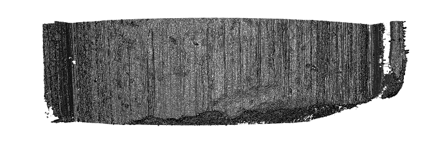

```{r, echo = F, warning = F, message = F}
#install.packages("tidyverse")
library(tidyverse)
```
\section{Background}  

For years, forensic firearms examiners have analyzed bullet striations through a process of visual feature comparison to determine whether two patterns are in sufficient agreement [@AFTE]. Examiners compare striation marks on land engraved areas of a bullet fired from a known barrel to a questioned bullet when investigating whether both bullets were propelled through the same gun barrel.  

These visual analyses are one of several feature comparison methods whose scientific foundations were questioned in the 2009 report by the National Research Council on Identifying the Needs of the Forensic Sciences Community [@NRC2009].  

Following that 2009 report, researchers began more intensely studying the validity of feature comparison methods as well as investigating the feasibility of developing image-analysis algorithms to complete automated, quantitative analyses. The main technological development that has created a pathway for image-analysis techniques is the introduction of high resolution 3D scanning technology to the field of forensic science. 

3D scanning technology not only allows for preservation of current and historical evidence in digital format, it also provides extremely detailed representations of forensically relevant portions of fired bullets. In recent years, this technology has been applied to the collection of topological images of both bullet lands and breech faces [e.g. @DeKinder1; @DeKinder2; @Bachrach1]. These 3D data have since been used in the development of several methods of varying complexity for automated comparison of land engraved areas [e.g. @Ma1; @Chu1; @Chu2; @Hare1]. 

Criticisms of firearms examination in recent years have focused on foundational validity and reliability [e.g. @PCAST2016]. These criticisms enforce the need for automated algorithms to undergo careful study and validation before they can be reasonably implemented to assist forensic firearms examiners. This process of algorithm development includes data pre-processing methods that ensure the correct data are being used in automated methods.  

Data pre-processing is not usually considered a significant barrier for most research endeavors. However, the nature of the 3D scanning process for land engraved areas (LEAs) introduces a challenging data pre-processing problem. To guarantee capture of an entire land engraved area, scanning across the object must begin and end in the neighboring groove engraved areas (GEAs). This ensures that the maximal amount of land surface area can be utilized in image-analysis methods, providing the most reliable feature generation and more robust results. This extraneous data collection, while necessary, dictates the most significant step in data pre-processing: correctly identifying between data from LEAs and GEAs. 

Dealing with these two areas separately is crucial to ensure accuracy and precision in subsequent processing steps. Removal of data from groove engraved areas significantly reduces the possibility of misidentification of the characteristics used in automated comparisons. In order to distinguish between these areas, we aim to identify "shoulder locations", the locations at which the LEA ends and the GEAs begin.  

Distinguishing between land and groove engraved areas is a problem at which human vision excels, but it is quite challenging for automatic procedures due to the nature of the data collected: the bullet curvature presents the main structure in the data, but the abrupt change between land and groove engraved areas introduces a competing structure. The atypical structure overwhelms standard statistical modeling techniques which cannot distinguish between the structures. An early solution based on data smoothing (described in [@Hare1]) can result in misidentification of deep striae as shoulder locations. The following work describes a better solution to this pre-processing problem based on robust statistical methods. 


\section{Data Source}  

The data used in this paper are high resolution 3D scans of 208 bullet land engraved areas. The scanned bullets come from Hamby Set 44 [@Hamby]. They consist of 35 total bullets from a set of 10 consecutively rifled Ruger P85 barrels. These LEAs were scanned at Iowa State University's High Resolution Microscopy Facility, and the scans are stored in 3D format as x3p files, conforming to the ISO5436-2 standard **cite ISO standard from sourceforge here??**. The data, seen in Figure 1, are gathered at a resolution of .645 microns per pixel. Physically, each land is approximately 2 millimeters in width. With a .645 micron per pixel resolution, data structures can contain more than 3 million individual data points. The 35 total bullets with 6 lands per bullet result in 210 individual lands.  

{width=600px}  


Image-analysis algorithms, while flexible enough to focus on a variety of patterns in the data, should mainly focus on comparison of striation marks and related characteristics that can be calculated. This focus addresses two concerns associated with introducing an automated approach. First, it ensures physical interpretability of characteristics that are calculated from the gathered data. Further, researchers are able to directly compare the visual process examiners use to an automated method which is rooted in the same principles; for example, when a data-based Consecutively Matching Striae (CMS) measure is calculated as part of the algorithm. This striation-focused approach suggests mainly utilizing horizontal slices of the 3D scan, called crosscuts, that capture the striation pattern horizontally across the surface, as seen in Figure 3.  

```{r, echo = F, warning = F, message = F, fig.height = 3, fig.cap = "Single crosscut of 3D bullet land data. The main data structure, located in the center, is comprised of the land engraved area. The groove engraved areas occur to the left and right sides of the crosscut."}
hamby44_eval <- readRDS("data/hamby44/hamby44_eval.rda")
bullet <- hamby44_eval$ccdata_w_resid[[48]]
bullet %>% ggplot() + 
  geom_point(aes(x = x, y = value_std)) + 
  theme_bw() + 
  labs(x = expression(paste("Relative Location (", mu, "m)")), 
       y = expression(paste("Relative Height (", mu, "m)"))) 
  
```


The final data consists of 2D crosscuts gathered from 3D imaging. The height values in the crosscuts were averaged over several crosscuts spaced out along the 3D image. This ensures predicted locations will be relatively applicable across the depth of the bullet. 

Two scans -- Barrel 9, Bullet 2, Land 3 and Unknowns, Bullet L, Land 5 -- were removed from consideration due to data quality concerns, leaving 208 individual crosscuts which function as the dataset.  


\section{Methodology}  

The nature of the data structure is such that much of the variability found within the data is due to the global structure of the physical object; that is, the curve of a bullet. Since the goal is to identify where the global data structure changes (where the shoulder location is), methods need to be able to separate out the LEA structure from the GEA structure. This can most effectively be accomplished by fitting a line to the curve of the bullet and analyzing the pattern of deviations from that curve. That is, fitting a statistical model to the curve of the bullet and examining the residual values. 

This 2-step process can e achieved with a statistical method which treats the secondary sstructure of the GEA as outlying data and fits the curve of the LEA alone. We examine and compare two methods for fitting the LEA structure. While the two approaches differ in methodology, they are both rooted in the ability to mitigate undue influence caused by outlying data. 

Once an appropriate fit is obtained, the fitted curve is used to obtain residual values and determine a good cutoff which separates the two competing structures within the residuals.

\subsection{Robust Linear Models}  

Due to the curved nature of the bullet, a quadratic linear model is a good candidate model. Linear models are based on minimizing the vertical squared distance between each data point and a fitted line. This means that if there are data points in unusual places, a linear model will fit a line that is pulled towards outlying data in order to minimize the overall sum of squared distances. In this particular data environment, the fitted curve can be easily influenced by GEA data, as is seen in Figure 4.  

The robust approach under the linear model framework focuses on minimizing the least absolute deviations. This method of minimization is less influenced by possibly large outlying values present in the GEA data. Due to the overwhelming majority of data being from the LEA structure, minimizing the least absolute deviations will favor fitting the LEA structure and allowing GEA data to have large residual values. This is preferable to the traditional linear model, which corrects for the presence of GEA data by compromising between the two competing structures, and does not fit either structure appropriately. A striking example of the difference in results from these two model frameworks is seen in Figure 4.  

```{r, echo = F, warning = F, message = F, fig.height = 4, fig.cap = "Example of a quadratic linear model fit and resulting residuals (top) compared to a robust quadratic linear model fit and residuals (bottom) for a single crosscut. The robust model is able to more effectively capture the curved structure of the LEA without being influenced by the GEA."}

lm <- lm(value_std~poly(x,2), data = bullet)
bullet$lm_pred <- predict(lm, newdata = bullet)
bullet$lm_resid <- with(bullet, value_std-lm_pred)
lm0 <- MASS::rlm(value_std~poly(x,2), data=bullet, maxit=100)
bullet$rlm_pred <- predict(lm0, newdata=bullet)
#bullet$rlm_absresid <- with(bullet, abs(value_std-pred))
bullet$rlm_resid <- with(bullet, value_std-rlm_pred)

p1_rlm <- bullet %>% ggplot() + 
  geom_point(aes(x = x, y = value_std)) + 
  theme_bw() + 
  labs(x = expression(paste("Relative Location (", mu, "m)")), 
       y = expression(paste("Relative Height (", mu, "m)")), title = "Linear Model Fit") + 
  geom_line(aes(x = x, y = lm_pred), color = "red") +
  theme(axis.title.x = element_text(size = rel(0.7)), 
        axis.title.y = element_text(size = rel(0.7)), 
        axis.text.x = element_text(size = rel(0.7)),
        axis.text.y = element_text(size = rel(0.7)), 
        title = element_text(size = rel(0.8)))

p2_rlm <- bullet %>% ggplot() + 
  geom_point(aes(x = x, y = lm_resid)) + 
  theme_bw() + 
  labs(x = expression(paste("Relative Location (", mu, "m)")), 
       y = expression(paste("Residual Height (", mu, "m)")), title = "Linear Model Residuals") + 
  geom_hline(yintercept = 0, color = "red") +
  theme(axis.title.x = element_text(size = rel(0.7)), 
        axis.title.y = element_text(size = rel(0.7)), 
        axis.text.x = element_text(size = rel(0.7)),
        axis.text.y = element_text(size = rel(0.7)), 
        title = element_text(size = rel(0.8)))

p3_rlm <- bullet %>% ggplot() + 
  geom_point(aes(x = x, y = value_std)) + 
  theme_bw() + 
  labs(x = expression(paste("Relative Location (", mu, "m)")), 
       y = expression(paste("Relative Height (", mu, "m)")), title = "Robust Linear Model Fit") + 
  geom_line(aes(x = x, y = rlm_pred), color = "red") +
  theme(axis.title.x = element_text(size = rel(0.7)), 
        axis.title.y = element_text(size = rel(0.7)), 
        axis.text.x = element_text(size = rel(0.7)),
        axis.text.y = element_text(size = rel(0.7)), 
        title = element_text(size = rel(0.8)))

p4_rlm <- bullet %>% ggplot() + 
    geom_point(aes(x = x, y = rlm_resid)) + 
  theme_bw() + 
  labs(x = expression(paste("Relative Location (", mu, "m)")), 
       y = expression(paste("Residual Height (", mu, "m)")), title = "Robust Linear Model Residuals") + 
  geom_hline(yintercept = 0, color = "red") +
  theme(axis.title.x = element_text(size = rel(0.7)), 
        axis.title.y = element_text(size = rel(0.7)), 
        axis.text.x = element_text(size = rel(0.7)),
        axis.text.y = element_text(size = rel(0.7)), 
        title = element_text(size = rel(0.8)))

library(gridExtra)
grid.arrange(p1_rlm, p2_rlm, p3_rlm, p4_rlm, ncol =2 )

```


Once a model has been fit for each crosscut, residual values are calculated. The model, having fit the structure of the LEA, results in small residuals scattered around zero in the LEA zone, and larger, mostly positive residuals in the GEA zones. Thus, the magnitudes of the residuals themselves can serve as one indicator of whether a data point is part of the LEA structure or the GEA structure. A cutoff value for the magnitude to separate the residuals from the two zones can be employed. 

The median absolute deviation (MAD), is a robust metric for the spread of points, similar to the standard deviation. Since we are dealing with unbalanced residual values, the MAD is preferable to the standard deviation to quantify the spread. Removing unusually high residual values is effective at removing the GEA data once the global structure has been fit. Residual values that are considered unusually high, or outlying, are values that are larger than 4*MAD. Any residual value larger than 4 times the median absolute deviation value can be seen as a "large" residual.  


Shoulder location predictions are calculated for each crosscut in the following manner:  
\begin{enumerate}
\item Fit a robust linear model of order 2 (i.e., quadratic) to the averaged crosscut.   
\item Calculate a residual value for each data point on the crosscut.  
\item Calculate the median absolute residual (MAD) for the crosscut.  
\item Remove all data points on the crosscut whose absolute residual value is greater than 4*MAD.  
\item Identify the range of the remaining X values - these are the predicted shoulder locations for that crosscut.   
\end{enumerate}


\subsection{Robust LOESS}  

Locally weighted regression, known as LOESS, is an approach that is not restricted by the need for perfect quadratic curvature. This is advantageous when working with bullets, as it is unrealistic to expect a flawless circular shape to remain after the bullet has been subjected to the forces of a gun barrel and striae have been impressed upon it.  

LOESS fits many models to small subsets of the data and combines them into one non-parametric fit of the data, rather than focusing on the overall structure of the data. This allows for greater flexibility. However, it also means that LOESS models are affected by GEA structures in a much more unpredictable manner. A model fitted on a subset of data that mainly falls in the GEA structure will look vastly different than another model fit with data from the LEA. This results in a combined prediction that misrepresents much of the data near one or both shoulder locations (see Figure 6). 

Just as the nature of LOESS models differs from traditional linear models, the robust approach must differ too. Robust LOESS utilizes an iterative process focused on re-weighting [see @Cleveland1]. First, an initial LOESS fit is created. This is followed by a step which gives smaller weights to data points with high residual values, and a subsequent LOESS fit with new weights applied. The down-weighting of values with high residual values slowly reduces the influence of a secondary structure within the data; here, the GEA data. This iterative process results in a non-parametric fit to the LEA structure that treats GEA data as less important, which is desirable in this context.  

While robust LOESS methods are more flexible than robust linear models, a model that is accurately fit to the LEA structure will result in the same expected residual structure as with robust linear models: positive and negative residuals scattered around zero in the LEA zone, and positive, possibly large residuals in the GEA zones. A similar approach as with the robust linear model cutoff value to distinguish between "large" residual values and reasonable ones; however, because this model is more flexible and fits more closely to the specific data at hand, our cutoff will be lower. A cutoff that performs well on the Hamby set 44 is twice the median absolute deviation (2*MAD). 


```{r, echo = F, warning = F, message = F, fig.height = 4, fig.cap = "Example of a LOESS model fit and residuals (top) compared to a robust LOESS model fit and residuals (bottom) for a single crosscut. The robust model is again able to more effectively capture the curved structure of the LEA without being influenced by the GEA."}
lo <- loess(value_std~x, data = bullet, span = 1)
bullet$lo_pred <- predict(lo, newdata = bullet)
bullet$lo_resid <- bullet$value_std - bullet$lo_pred


p1_rlo <- bullet %>% ggplot() + 
  geom_point(aes(x = x, y = value_std)) + 
  theme_bw() + 
  labs(x = expression(paste("Relative Location (", mu, "m)")), 
       y = expression(paste("Relative Height (", mu, "m)")), title = "LOESS Fit") + 
  geom_line(aes(x = x, y = lo_pred), color = "red") +
  theme(axis.title.x = element_text(size = rel(0.7)), 
        axis.title.y = element_text(size = rel(0.7)), 
        axis.text.x = element_text(size = rel(0.7)),
        axis.text.y = element_text(size = rel(0.7)), 
        title = element_text(size = rel(0.8)))

p2_rlo <- bullet %>% ggplot() + 
  geom_point(aes(x = x, y = lo_resid)) + 
  theme_bw() + 
  labs(x = expression(paste("Relative Location (", mu, "m)")), 
       y = expression(paste("Residual Height (", mu, "m)")), title = "LOESS Residuals") + 
  geom_hline(yintercept = 0, color = "red") +
  theme(axis.title.x = element_text(size = rel(0.7)), 
        axis.title.y = element_text(size = rel(0.7)), 
        axis.text.x = element_text(size = rel(0.7)),
        axis.text.y = element_text(size = rel(0.7)), 
        title = element_text(size = rel(0.8)))


p3_rlo <- bullet %>% ggplot() + 
  geom_point(aes(x = x, y = value_std)) + 
  theme_bw() + 
  labs(x = expression(paste("Relative Location (", mu, "m)")), 
       y = expression(paste("Relative Height (", mu, "m)")), title = "Robust LOESS Fit") + 
  geom_line(aes(x = x, y = rlo_pred), color = "red") +
  theme(axis.title.x = element_text(size = rel(0.7)), 
        axis.title.y = element_text(size = rel(0.7)), 
        axis.text.x = element_text(size = rel(0.7)),
        axis.text.y = element_text(size = rel(0.7)), 
        title = element_text(size = rel(0.8)))


p4_rlo <- bullet %>% ggplot() + 
    geom_point(aes(x = x, y = rlo_resid)) + 
  theme_bw() + 
  labs(x = expression(paste("Relative Location (", mu, "m)")), 
       y = expression(paste("Residual Height (", mu, "m)")), title = "Robust LOESS Residuals") + 
  geom_hline(yintercept = 0, color = "red") +
  theme(axis.title.x = element_text(size = rel(0.7)), 
        axis.title.y = element_text(size = rel(0.7)), 
        axis.text.x = element_text(size = rel(0.7)),
        axis.text.y = element_text(size = rel(0.7)), 
        title = element_text(size = rel(0.8)))


#library(gridExtra)
grid.arrange(p1_rlo, p2_rlo, p3_rlo, p4_rlo, ncol =2 )
```


Shoulder location predictions are calculated for each crosscut in the following manner: 
\begin{enumerate}
\item Fit a robust LOESS model with a span of 1 to the averaged crosscut. This is fit using the `locfit.robust` function in the `locfit` package in R.
\item Calculate a residual value for each data point on the crosscut.  
\item Calculate the median absolute deviation (MAD) for the crosscut.  
\item Remove all data points on the crosscut whose absolute residual value is greater than 2*MAD.  
\item Identify the range of the remaining Y values - these are the predicted shoulder locations for that crosscut.   
\end{enumerate}


\section{Results}  

In order to assess the accuracy of these predictions, we take a unique approach. To calculate a quantitative measure for the overall performance of predictions, we first manually identified "ground truth" shoulder locations.  

The numerical comparison of predicted and manually identified locations can be tricky; distance metrics alone do not suffice to represent the true character of a prediction's accuracy. For example, a predicted shoulder location that falls 10 data points away from the manually identified shoulder location could be caused by noise in the data, missing data points, or simply the scale of the data. Note that a span of 10 data points represents only 6.45 microns in physical space. Alternatively, a distance of 10 points could indeed be part of the groove engraved area, and thus being incorrectly identified could potentially cause problems in subsequent analyses.  
   
Thus, a more suitable measure is to investigate the residual values resulting from the robust LOESS model that fall in the range spanned by the predicted and manually identified shoulder location. This method penalizes shoulder location predictions that are too far out to the side and leave GEA data in the main structure. 

Because the robust LOESS most reliably approximates the curved shape of the bullet land due to its flexibility, we want to use residual values resulting from that model to assess final performance of all methods. Residual values from the GEA will not necessarily be uniformly large, but are expected to be positive as their structure and the modeling technique dictate that they would fall above the fitted line from robust LOESS. 

Given the assumption of positive residuals in the GEA, even a 10-point difference can quickly add to a large residual sum. However, a 10-point difference within the land engraved area will be balanced out by the presence of both positive and negative residual values and remain closer to zero.  

For this reason, gathering the sum of residuals between the predicted location and the manually identified location is appropriate. This residual sum is referred to as an "inaccuracy score" for which higher values indicate a higher level of inaccuracy. An inaccuracy score was calculated separately for the left hand side and right hand side predictions for each crosscut in the data set. 

Of interest are the distributions of these inaccuracy scores across all 208 lands used in the study. A distribution that has a smaller spread and is close to zero is ideal; this suggests many of the predicted shoulder locations are very close to the manually identified locations, and predictions are removing many of the outlying GEA points. A distribution with a wider spread or many high, outlying inaccuracy scores suggests a greater degree of uncertainty and inaccuracy for a particular method.  

It is important to note that different results are expected for the left and right shoulder locations. Within Hamby set 44, almost all scans have a well-defined left groove. Left here is defined as visually left on the scan; this is the side the scan begins on, so a well-defined distinction between GEA and LEA is expected. Often, a less clear distinction is seen on the right side of the scan, with sometimes no apparent shoulder location visible. For this reason it is preferable to separate the left and right for visual inspection of results; a method could excel on one side but fall short on another.   


```{r, echo = F, warning = F, message = F, fig.height = 8, fig.width = 8, fig.cap = "Distribution of inaccuracy scores for data smoothing method, robust linear model method, and robust LOESS method, separated by left and right shoulder locations. A tight distribution with few high values indicates good performance across the LEAs in the data set."}
hamby44_eval_paper <- readRDS("data/hamby44/hamby44_eval_paper.rda")

  dataset <- hamby44_eval_paper
  methods <- c("rollapply", "mad2", "mad4rlm")
  colnames <- c()
  for (i in 1:length(methods)){
    colnames <- c(colnames, paste0("score_left_", methods[i]))
    colnames <- c(colnames, paste0("score_right_", methods[i]))
  }
  plot_df <- dataset %>% ungroup() %>% 
    select(colnames) %>%  
    gather(method, score) %>% 
    mutate(GrooveMethod = unlist(purrr::map(method, .f = function(x){
      strsplit(x, "_")[[1]][3]
        })), GrooveSide = unlist(purrr::map(method, .f = function(x){
      strsplit(x, "_")[[1]][2]
        }))
    )
  plot_df$GrooveLabels <- ifelse(plot_df$GrooveSide=="left", "left shoulder location", "right shoulder location")
  plot_1 <- plot_df %>% 
    ggplot() + geom_boxplot(aes(x = GrooveMethod, y = abs(score), fill = GrooveMethod)) + 
      theme_bw() + labs(x = "Groove Side", y = "Inaccuracy Score", title = "Full Distribution") + 
    facet_wrap(~GrooveLabels ) + 
    scale_fill_manual(name="Method", values=c("#E69F00", "#56B4E9","#009E73"),
                         breaks=c("rollapply", "mad4rlm", "mad2"),
                         labels=c("Rollapply", "Robust Linear Model", "Robust LOESS")) + 
    scale_x_discrete(name = "", breaks = c("rollapply", "mad4rlm", "mad2"), 
                     labels = c("Rollapply", "Robust Linear Model", "Robust LOESS"), 
                     limits=c("rollapply","mad4rlm","mad2")) + 
    theme(axis.text.x = element_text(angle =10))
  plot_zoom <- plot_df %>% filter(score < 5000) %>% 
    ggplot() + geom_boxplot(aes(x = GrooveMethod, y = abs(score), fill = GrooveMethod)) + 
      theme_bw() + labs(x = "Groove Side", y = "Inaccuracy Score", title = "Truncated at 5000") + 
    facet_wrap(~GrooveLabels ) + 
    scale_fill_manual(name="Method", values=c("#E69F00", "#56B4E9","#009E73"),
                         breaks=c("rollapply", "mad4rlm", "mad2"),
                         labels=c("Rollapply", "Robust Linear Model", "Robust LOESS")) + 
        scale_x_discrete(name = "", breaks = c("rollapply", "mad4rlm", "mad2"), 
                         labels = c("Rollapply", "Robust Linear Model", "Robust LOESS"),
                         limits=c("rollapply","mad4rlm","mad2")) + 
    theme(axis.text.x = element_text(angle =10))
  library(gridExtra)
  grid.arrange(plot_1, plot_zoom)

```


```{r, echo = F, warning = F, message = F, fig.height = 4, fig.cap = "Distribution of inaccuracy scores for data smoothing method, robust linear model method, and robust LOESS method, separated by left and righth shoulder locations. Inaccuracy scores are placed into three categories: less than 100 microns (ideal), between 100 and 1000 microns, and greater than 1000 microns. A larger proportion of inaccuracy scores under 100 microns indicates good performance across LEAs in the data set."}


  dataset <- hamby44_eval_paper
  methods <- c("rollapply", "mad2", "mad4rlm")
  colnames <- c()
  for (i in 1:length(methods)){
    colnames <- c(colnames, paste0("score_left_", methods[i]))
    colnames <- c(colnames, paste0("score_right_", methods[i]))
  }
  plot_df <- dataset %>% ungroup() %>% 
    select(colnames) %>%  
    gather(method, score) %>% 
    mutate(GrooveMethod = unlist(purrr::map(method, .f = function(x){
      strsplit(x, "_")[[1]][3]
        })), GrooveSide = unlist(purrr::map(method, .f = function(x){
      strsplit(x, "_")[[1]][2]
        }))
    ) %>% mutate(AccuracyCategory = ifelse(abs(score) < 100, "<100", "100, 1000")) %>% 
    mutate(AccuracyCategory = ifelse(abs(score) >= 1000, ">1000", AccuracyCategory))
  
  plot_df$GrooveLabels <- ifelse(plot_df$GrooveSide=="left", "left shoulder location", "right shoulder location")
  plot_df %>% 
    ggplot() + geom_bar(aes(x = GrooveMethod, fill=factor(AccuracyCategory, levels=c(">1000","100, 1000", "<100"))), position = "stack") + 
      theme_bw() + labs(x = "Groove Method", y = "Number of Lands") + 
    facet_wrap(~GrooveLabels ) + 
    scale_fill_manual(name="Inaccuracy Score", values=c("#E69F00", "#56B4E9", "#009E73"),
                         breaks=c(">1000", "100, 1000", "<100"),
                         labels=c("Greater than 1000", "Between 100 and 1000", "Less than 100")) + 
    scale_x_discrete(name = "Method", breaks = c("rollapply", "mad4rlm", "mad2"), 
                     labels = c("Rollapply", "Robust Linear Model", "Robust LOESS"), 
                     limits=c("rollapply","mad4rlm","mad2")) + 
    theme(axis.text.x = element_text(angle =10, size = 8))
  
```


\section{Conclusions}  

Both the robust linear model and robust LOESS approaches outperform currently implemented solutions based on data smoothers. Of the two, the robust LOESS approach clearly outperforms the robust linear model. This hierarchy of performance is well within expectation given the strength of robust approaches in general as well as the flexibility of LOESS applied to this data type. Robust LOESS also readily handles variation introduced in the process of translating the physical bullet into a 3D object. If there is too much variability in how the bullet is placed relative to the plane of reference **(??)** on the microscope, crosscuts can have tilted shapes relative to the x-axis which a quadratic linear model would fail to address. In these situations, LOESS excels.  

While the cutoff values presented work well on Hamby set 44, additional cross-validation will need to be implemented on a variety of bullet types. Depth of striae, physical size of bullet due to caliber, and non-traditional rifling techniques may require alterations to this cutoff value. In addition, a study of the effect of implementing a robust LOESS data pre-processing strategy on overall automated image-analysis methods will need to be addressed. Due to increased accuracy of predicted shoulder locations, the authors expect an increase in accuracy in bullet matching algorithms. However, this will need to be validated on a variety of data sets prior to implementation without human intervention in the automated process.   


\section{References}  

```{r,echo = F}
    #pandoc_args: [
    #  "-V", "classoption=twocolumn"
    #]
```


